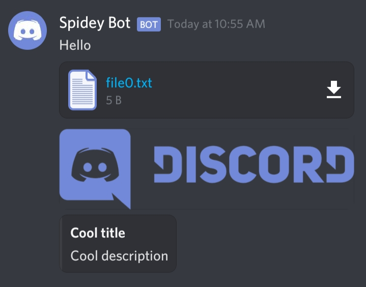
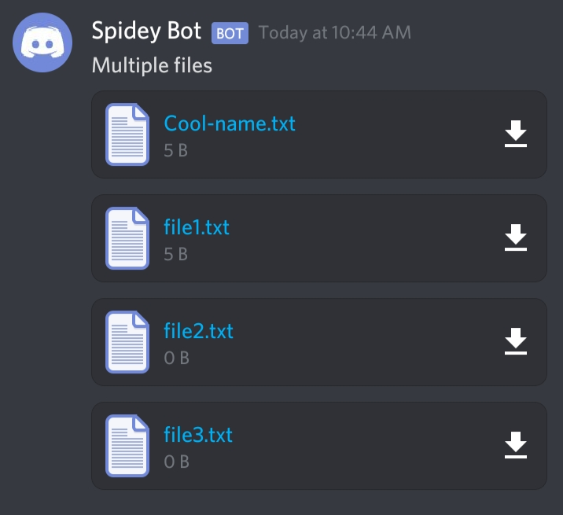
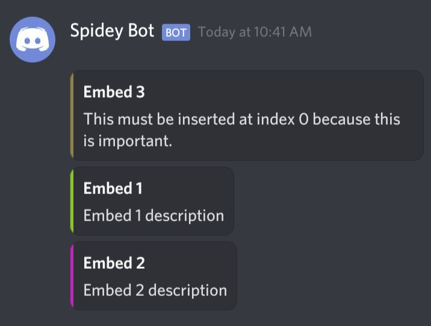
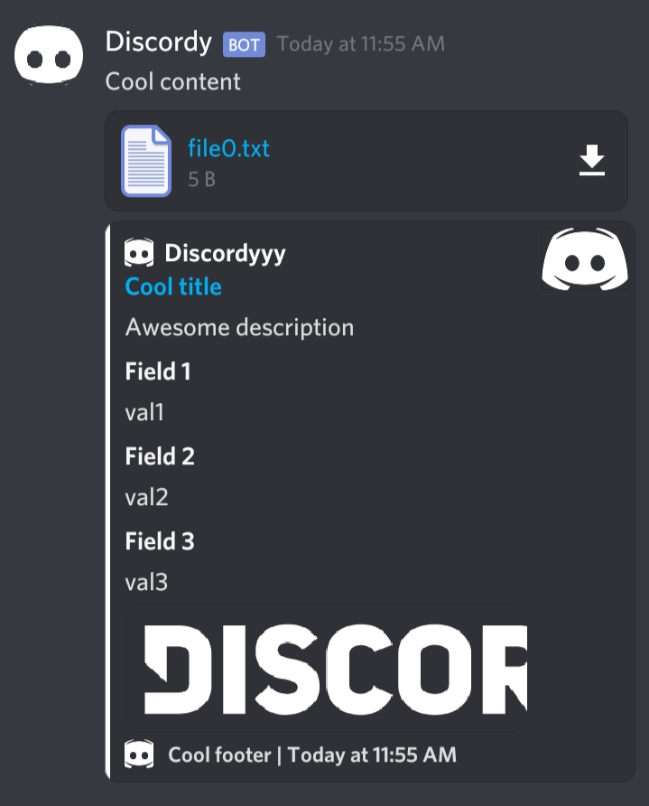

# DiscordWebhook-PHP
Easily send a message to discord with embeds or files.

Released: **3/18/21**

Updated: **---**


> *With built in [DiscordEmbed-PHP](https://github.com/renzbobz/DiscordEmbed-PHP) for creating embed object easily :D*


## Getting started

### Installation
Download the DiscordWebhook.php file and then require it to your project and you're ready to go!

### Usage
Create new instance and set your desired values.
```php
$dw = new DiscordWebhook($webhook);
# or
$dw = new DiscordWebhook($options);
```
#### Options

| Name          | Property name   | Type       | Default  | Description                     |
| ------------- |:---------------:|:----------:|:--------:| -------------------------------:|
| username      | username        | string     |          | Bot name                        |
| avatar        | avatar_url      | string     |          | Bot avatar url                  |
| webhook       | webhook         | string     |          | Discord webhook url             |
| wait_message  | wait_message    | boolean    | true     | Wait for message to be sent     |

### Create new message
#### Plain message
```php
$msg = $dw->newMessage("Hello");
# or
$msg = $dw->newMessage()
  ->setContent("Hello");
$res = $msg->send();
```

#### With embed
```php
$msg = $dw->newMessage()
  ->setContent("Hello")
  ->setTitle("Cool title")
  ->setDescription("Cool description");
$res = $msg->send();
```

> For more information about the embed, please look at [DiscordEmbed-PHP](https://github.com/renzbobz/DiscordEmbed-PHP).

#### With file
```php
$msg = $dw->newMessage()
  ->setContent("Hello")
  ->setTitle("Cool title")
  ->setDescription("Cool description")
  ->addFile("file0.txt")
  ->addFile("image.png", "Cool_name.png");
$res = $msg->send();
```



### Response object
| Name       | Value        | Description                                                |
| ---------- |:------------:|:----------------------------------------------------------:|
| success    | boolean      | Return's true if response code is in range between 200-299 |
| body       | string       | Response body                                              |
| code       | number       | Response code                                              |
| message    | object       | Return's the message object if successfully sent           |


You can also set the default values for your upcoming messages.
```php 
$dw->setColor("ffffff");
$msg = $dw->newMessage()
  ->setTitle("Cool title")
  ->setDescription("Cool description");
$msg2 = $dw->newMessage()
  ->setTitle("Cool title 2")
  ->setDescription("Cool description 2");
/*
# No need to set the color again if you want the default value
$msg = $dw->newMessage()
  ->setColor("ffffff")
  ->setTitle("Cool title")
  ->setDescription("Cool description");
*/
```


## Features
### Url
Every url is path ready so it means that you can just pass the file path and it resolves to complete url.

Example:
```php
->setAuthor("Cool name", "author.php", "images/author-icon.png");
# https://yourwebsite.com/author.php
# https://yourwebsite.com/images/author-icon.png
->setThumbnail("../thumbnail.png");
# https://yourwebsite.com/thumbnail.png
->setAvatar("bot_avatar.jpg");
# https://yourwebsite.com/bot_avatar.jpg
```

## Methods
> For the embed, please look at [DiscordEmbed-PHP](https://github.com/renzbobz/DiscordEmbed-PHP).

### New message
***$content** is optional.*
```php
->newMessage($content);
```
### Send message
***$webhook** and **$options** are optional.*
```php
->send($webhook);
# or
->send($options);
```
### Bot username
```php
->setUsername($username);
```
### Bot avatar
```php
->setAvatar($avatar);
```
### Webhook
```php
->setWebhook($webhook);
```
### Content
```php
->setContent($content);
->appendContent($content);
->prependContent($content);
```
### Text-to-speech
```php
->setTts($tts=false);
```
### Chain embeds
***$index** is optional.*
```php
->insertTo($embed, $index);
```
### Files
***$name** is optional.*

*Splice file's **$files** is optional unless you want to insert some files.*
```php
->addFile($path, $name);
->addFiles(...$files);
->spliceFiles($startIndex, $deleteCount, ...$files);
```
### To Array
```php
->toArray();
```
### To JSON
```php
->toJSON();
```

## More example
#### Multiple files
```php
$msg = $dw->newMessage("Multiple files")
  ->addFile("file0.txt", "Cool-name.txt")
  ->addFile("file1.txt")
  ->addFiles(
    ["file2.txt"],
    ["file3.txt"]
  )
  ->send();
print_r($msg);
```


#### Multiple embeds
```php
$embed1 = $dw->newMessage()
  ->setTitle("Embed 1")
  ->setDescription("Embed 1 description")
  ->setColor("RANDOM");
  
$embed2 = $dw->newMessage()
  ->setTitle("Embed 2")
  ->setDescription("Embed 2 description")
  ->setColor("RANDOM")
  ->insertTo($embed1);
  
$embed3 = $dw->newMessage()
  ->setTitle("Embed 3")
  ->setDescription("This must be inserted at index 0 because this is important.")
  ->setColor("RANDOM")
  ->insertTo($embed1, 0);
  #                   ^
  #                 index

# $embed1 now contains three embed  
$res = $embed1->send();
print_r($res);
```


#### +
```php
$icon = "https://www.seekpng.com/png/full/20-205511_discord-transparent-staff-discord-logo-black-and-white.png";
$image = "https://discord.com/assets/f72fbed55baa5642d5a0348bab7d7226.png";

$dw->setUsername("Discordy");
$dw->setAvatar($icon);

$dw->newMessage()
->setContent("Cool content")
->setTitle("Cool title", "https://discordy.site")
->setDescription("Awesome description")
->setColor("ffffff")
->setTimestamp()
->setAuthor("Discordyyy", "https://discordy.site", $icon)
->setImage($image)
->setThumbnail($icon)
->setFooter("Cool footer", $icon)
->addField("Field 1", "val1")
->addFields(
  ["Field 2", "val2", true],
  ["Field 3", "val3", true]
)
->addFile("file0.txt")
->send();
```

