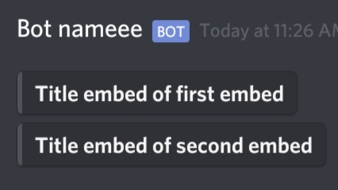

# DiscordWebhook-PHP
Easily send embedded/plain message.

Coded on phone - 8/16/20

# Usage
Include `DiscordWebhook.php` to your project then 
create an instance of the class.
```php
$dw = new DiscordWebhook("botName", "botAvatar.jpg", "WEBHOOK_URL");
```
You can also do this
```php
new DiscordWebhook("botName", "botAvatar");
new DiscordWebhook("botName", "WEBHOOK_URL");
new DiscordWebhook("botName");
new DiscordWebhook("botIcon");
new DiscordWebhook("WEBHOOK_URL");
new DiscordWebhook();
# You can set the webhook later if you send a message
```

## Send embedded message 

##### Single embed
```php
// You need to pass an ID to access your embed object because you can also create more embed object.
// Embed Id starts with #
$embed = $dw->embed("#embedId");

// and now set what you want
$embed["title"] = "Title of embed";
$embed["description"] = "Description of embed";
$embed["color"] = 1752220;

// then push the embed
$dw->push("#embedId", $embed);

// and finally send it
$res = $dw->send("#embedId");

// $res contains ["success" => boolean, "response" => actual_response_from_discord, "statusCode" => 200]

// You can also use callback
$dw->send("#embedId", function($success, $response, $statusCode) {
 // Do something
});

// and set webhook
$dw->send("#embedId", "WEBHOOK_URL");
```


##### Multiple embed
```php
$embed = $dw->embed("#embedId", 2); // 2 object is created and returned

$e1 = $embed[0]; // Access first embed
$e1["title"] = "Title embed of first embed";

$e2 = $embed[1]; // Access second embed
$e2["title"] = "Title embed of second embed";

// then push them
$dw->push("#embedId", $e1, $e2);

$dw->send("#embedId");
```



## Send plain message

##### Shorthand method
```php
$dw->send("Message here!");
```

##### Normal method
```php
$msg = $dw->embed("#msg");
$msg["content"] = "Message here!";
$dw->push("#msg", $msg);
$dw->send("#msg");
```


## Remember
```php
/*
  embed() have two arguments
  1st arg: #id123 (embedId) [required]
  2nd arg: 3 (embedLength) [optional]
*/
$dw->embed(); 

/*
  push() can have more than 2 arguments
  1st arg: #id123 (embedId) [required]
  2nd arg: embedObject1 [required]
  3rd arg: embedObject2
*/
$dw->push();

/*
  send() have three arguments
  1st arg: #id123 (embedId) [required]
  2nd arg: webhook_url [optional]
  3rd arg: callback [optional]
*/
$dw->send();
```


## More example
```php
$icon = "https://www.seekpng.com/png/full/20-205511_discord-transparent-staff-discord-logo-black-and-white.png";
$image = "https://discord.com/assets/f72fbed55baa5642d5a0348bab7d7226.png";
$webhook = "WEBHOOK_URL";

$dw = new DiscordWebhook("Discordy", $icon, $webhook);

$embed = $dw->embed("#embedStructure");

$embed = [
  "content" => "Content above the embed",
  "title" => "Title of embed",
  "url" => "https://discordy.site",
  "description" => "Description of embed",
  "color" => 1752220,
  "timestamp" => date("c", time()),
  "author" => [
    "name" => "Author name", 
    "url" => "https://author.site",
    "icon_url" => $icon
  ],
  "thumbnail" => [
    "url" => $icon
  ],
  "image" => [
    "url" => $image
  ],
  "footer" => [
    "text" => "Footer text",
    "icon_url" => $icon
  ],
  "fields" => [
    [
      "name" => "Field 1",
      "value" => "field 1 value"
    ],
    [
      "name" => "Field 2",
      "value" => "field 2 value"
    ],
    [
      "name" => "Field 3",
      "value" => "field 3 value"
    ]
  ]
]; 

$dw->push("#embedStructure", $embed);

$dw->send("#embedStructure", function($success, $res) {
  echo $res;
});
```


