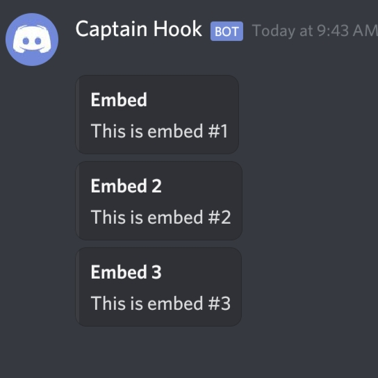

# DiscordWebhook-PHP
Easily send embedded/plain message.

Coded on phone - 8/18/20

Updated - 3/9/21


# New update! v.3.5
### What's new?
Set default values
```php
$dw = new DiscordWebhook();
$dw->setUsername("Bot name");
$dw->setAvatar("avatar.jpg");
$dw->setWebhook("...");
// OR
$dw = new DiscordWebhook("Bot name", "avatar.jpg", "...");

$dw->setAuthor("Renz");
// This will now automatically set to current timestamp if you don't pass one
$dw->setTimestamp();
```
You can now set text-to-speech
```php
$embed->setTts(true);
// FOR PLAIN MESSAGE
$tts = true;
$dw->send("Message.", $tts);
```
You can now insert field in any index you desired
```php
$index = 2;
$embed->addField($name, $value, $inline, $index);
```

## New update v.3 (2/26/21)
### What's new?
You can now send multiple embed. Like chaining embed? 😅
```php
$dw = new DiscordWebhook($webhook);

$e = $dw->newEmbed()
  ->setTitle("Embed")
  ->setDescription("This is embed #1");
  
$e2 = $dw->newEmbed()
  ->setTitle("Embed 2")
  ->setDescription("This is embed #2");
  
$e3 = $dw->newEmbed()
  ->setTitle("Embed 3")
  ->setDescription("This is embed #3");
  
$res = $dw->sendMultiEmbed($e,$e2,$e3);
// or $dw->sendMultiEmbed($webhook,$e,$e2,$e3);

print_r($res);
```


## New update v.2.5 (12/21/20)
### What's new?
You can now append or prepend to title, description, or content.
```php
$points = 5;
$embed->setTitle("You've won the game!");
$pointsAdded = $db->query("UPDATE users SET points = points + $points WHERE user_id = 1");
if ($pointsAdded) $embed->appendTitle("\nYou've earned $points points!");
/*
  You've won the game!
  You've earned 5 points!
*/
$embed->prependTitle("🎉 ");
/*
  🎉 You've won the game!
  You've earned 5 points!
*/
```

## New update v.2 (12/03/20)
### What's new?
You can now get the array data of the embed
```php
$data = $embed->getData();
```
And this will now automatically encoded to json format
```php
echo $embed; // outputs data in json format
```
You can now also make your own request
```php
$ch = curl_init($webhook);
curl_setopt_array($ch, [
  CURLOPT_HTTPHEADER => ['Content-type: application/json'],
  CURLOPT_RETURNTRANSFER => true,
  CURLOPT_FOLLOWLOCATION => true,
  CURLOPT_POST => true,
  CURLOPT_POSTFIELDS => $embed // No need to json_encode, this will automatically formatted to json
]);
$res = curl_exec($ch);
curl_close($ch);
// display result
echo $res; 
```


# Usage
Include `DiscordWebhook.php` to your project then 
create an instance of the class.
```php
$dw = new DiscordWebhook("botName", "botAvatar.jpg", "WEBHOOK_URL");
```
You can also do this
```php
new DiscordWebhook("botName", "botAvatar.jpg");
new DiscordWebhook("botName", "WEBHOOK_URL");
new DiscordWebhook("botName");
new DiscordWebhook("botAvatar.jpg");
new DiscordWebhook("WEBHOOK_URL");
new DiscordWebhook();
# You can set the webhook later if you send a message
```

## Send embedded message 

```php
$res = $dw->newEmbed()
->setTitle("Title of embed")
->setDescription ("Description of embed")
->setColor(1752220)
->send("WEBHOOK_HERE_OPTIONAL");

# $res contains ["success" => boolean, "response" => actuall_response, "code" => status_code]
```


## Send plain message

```php
$dw->send("Message here!", "WEBHOOK_HERE_OPTIONAL");
```


### You can also do this
Send embed when ready
```php
# Make your embed
$embed = $dw->newEmbed()
->setTitle("Hello discord!");

# Then send it when you're ready
if ($ready) {
  $embed->send();
}
```
Create more than one embed
```php
$embed = $dw->newEmbed()
->setTitle("Embed 1")
->send();

$embed2 = $dw->newEmbed()
->setTitle("Embed 2");

$embed3 = $dw->newEmbed()
->setTitle("Embed 3");

$embed2->send();
$embed3->send();
```

## Methods
— Set bot username
```php
$dw->setUsername(<username>);
```
— Set bot avatar
```php
$dw->setAvatar(<avatar>);
```
— Set webhook
```php
$dw->setWebhook(<webhook>);
```
— Content
```php
$embed->setContent(<message>)
->appendContent(<message>)
->prependContent(<message>);
```
— Text to speech
```php
$embed->setTts(<tts:boolean>);
```
— Author
```php
$embed->setAuthor(<name>[, <url>[, <icon_url> ]]);
```
— Title
```php
$embed->setTitle(<title>[, <url> ])
->appendTitle(<title>)
->prependTitle(<title>);
```
— Description
```php
$embed->setDescription(<description>)
->appendDescription(<description>)
->prependDescription(<description>);
```
— Color
```php
$embed->setColor(<color>);
```
— Thumbnail
```php
$embed->setThumbnail(<url>[, <height>[, <width> ]]);
```
— Image
```php
$embed->setImage(<url>[, <height>[, <width> ]]);
```
— Timestamp
```php
$embed->setTimestamp(<timestamp>);
```
— Footer
```php
$embed->setFooter(<text>[, <icon_url> ]);
```
— Field
```php
$embed->addField(<name>, <value>[, <inline> ]);
```
— Send
```php
$embed->send([ message|webhook ]);
```
— Get Data
```php
$embed->getData();
```
— Send Multiple Embed
```php
$dw->sendMultiEmbed([webhook,]<embed>,<embed2>,...);
```
— Validate
```php
$dw->isDiscordWebhook(<url>);
```

## Examples
```php
$icon = "https://www.seekpng.com/png/full/20-205511_discord-transparent-staff-discord-logo-black-and-white.png";
$image = "https://discord.com/assets/f72fbed55baa5642d5a0348bab7d7226.png";
$webhook = "WEBHOOK_URL";

$dw = new DiscordWebhook("Discordy", $icon, $webhook);

$dw->newEmbed()
->setContent("Content above the embed")
->setTitle("Title of embed", "https://discordy.site")
->setDescription("Description of embed")
->setColor(1752220)
->setTimestamp(date("c", time()))
->setAuthor("Author name", "https://author.site", $icon)
->setImage($image)
->setThumbnail($icon)
->setFooter("Footer text", $icon)
->addField("Field 1", "field 1 value")
->addField("Field 2", "field 2 value")
->addField("Field 3", "field 3 value")
->send();
```


