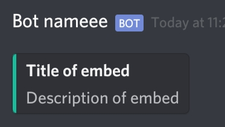
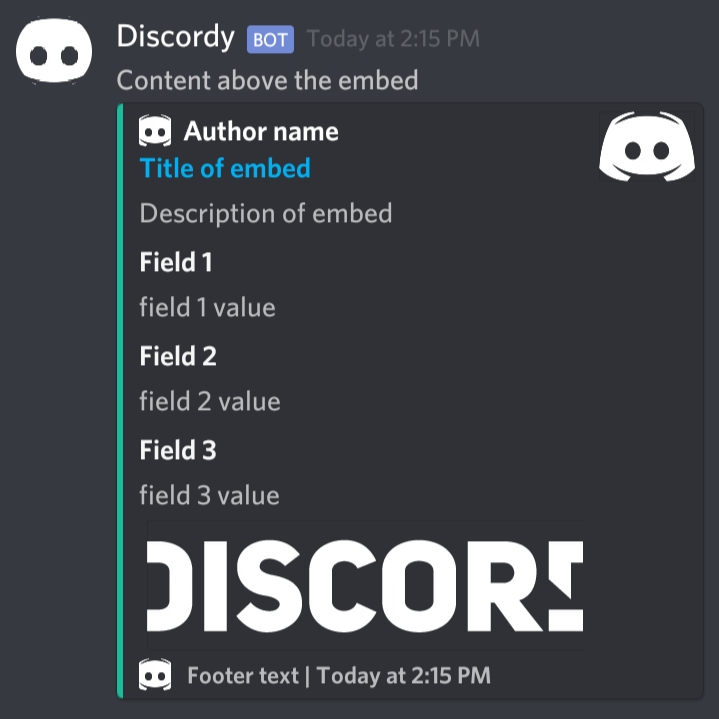

# DiscordWebhook-PHP (New)
Easily send embedded/plain message.

Coded on phone - 8/18/20

# Usage
Include `DiscordWebhook.php` to your project then 
create an instance of the class.
```php
$dw = new DiscordWebhook("botName", "botAvatar.jpg", "WEBHOOK_URL");
```
You can also do this
```php
new DiscordWebhook("botName", "botAvatar");
new DiscordWebhook("botName", "WEBHOOK_URL");
new DiscordWebhook("botName");
new DiscordWebhook("botIcon");
new DiscordWebhook("WEBHOOK_URL");
new DiscordWebhook();
# You can set the webhook later if you send a message
```

## Send embedded message 

```php
$res = $dw->newEmbed()
->setTitle("Title of embed")
->setDescription ("Description of embed")
->setColor(1752220)
->send("WEBHOOK_HERE_OPTIONAL");

# $res contains ["success" => boolean, "response" => actuall_response, "code" => 200]
```



## Send plain message

```php
$dw->send("Message here!", "WEBHOOK_HERE_OPTIONAL");
```


## More example
```php
$icon = "https://www.seekpng.com/png/full/20-205511_discord-transparent-staff-discord-logo-black-and-white.png";
$image = "https://discord.com/assets/f72fbed55baa5642d5a0348bab7d7226.png";
$webhook = "WEBHOOK_URL";

$dw = new DiscordWebhook("Discordy", $icon, $webhook);

$dw->newEmbed()
->setContent("Content above the embed")
->setTitle("Title of embed", "https://discordy.site")
->setDescription("Description of embed")
->setColor(1752220)
->setTimestamp(date("c", time()))
->setAuthor("Author name", "https://author.site", $icon)
->setImage($image)
->setThumbnail($icon)
->setFooter("Footer text", $icon)
->addField("Field 1", "field 1 value")
->addField("Field 2", "field 2 value")
->addField("Field 3", "field 3 value")
->send();
```




